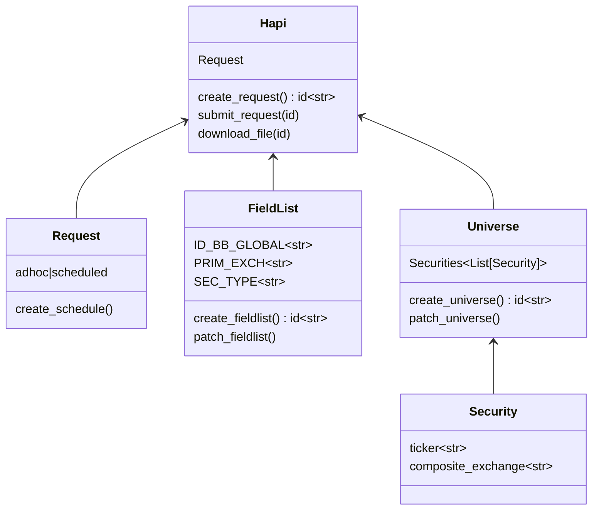

```mermaid
classDiagram
    Hapi <-- Request
    Hapi <-- FieldList
    Hapi <-- Universe
    Universe <-- Security

    class Hapi {
        Request
        create_request() id~str~
        submit_request(id)
        download_file(id)
    }

    class FieldList {
        ID_BB_GLOBAL~str~
        PRIM_EXCH~str~
        SEC_TYPE~str~
        create_fieldlist() id~str~
        patch_fieldlist()
    }

    class Universe {
        Securities~List[Security]~
        create_universe() id~str~
        patch_universe()
    }

    class Request {
        adhoc|scheduled
        create_schedule()
    }

    class Security {
        ticker~str~
        composite_exchange~str~
    }
```